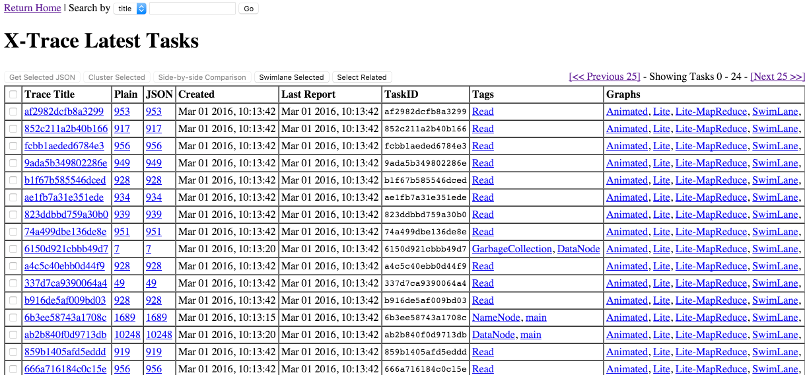

## X-Trace - Report Server

The X-Trace server is a standalone component that receives reports from clients and persists them into a database.  It provides a webserver for accessing reports and visualizing them.

#### Running the Server

The `backend` executable will run an X-Trace server and a pubsub server within the same process

    xtrace/server/target/appassembler/bin/backend

This will pick up any PubSub configuration (see [PubSub](../tracingplane/pubsub/index.html)).

#### Receiving Reports

The X-Trace server subscribes to the topic "xtrace", configurable with `xtrace.pubsub.topic`.  Reports generated by X-Trace clients will be published to this topic and received by the server.

#### Storing Reports

The X-Trace server persists reports on disk, serialized using protocol buffers.  Each task's reports are grouped together and stored in a single file.  Metadata about tasks is persisted in a Derby database.  By default, reports are stored in a relative directory `./xtrace-data`.  This can be configured with the `xtrace.server.datastore.dir` property, to something more permanent.  Each time the X-Trace server starts, it will pick up any existing reports that were previously stored.  To remove X-Trace data it is sufficient to just delete the data directory.

#### WebServer

The X-Trace server also runs a webserver for accessing and visualizing reports.  The configuration properties `xtrace.server.bind-hostname` and `xtrace.server.webui.port` configure the webserver, by default binding to 0.0.0.0 on port 4080.  

The webserver has APIs for retrieving reports by task ID in plaintext and JSON form.

Visit http://localhost:4080 to view the X-Trace dashboard:

Each unique taskID will show up as a row in the dashboard.  The Plain and JSON columns get the raw reports for each task ID.  The Tags column displays any tags that were added to the trace (eg, if anywhere during the request, `XTrace.tag(x, y, z)` was called, the tags x, y, and z will show up here).  The Graphs column gives links to visualize tasks -- the page [X-Trace/Visualization](visualization) has more information about X-Trace visualizations.

#### Configuration

The X-Trace server uses the following default config values:

	// X-Trace Server Config
	xtrace {
	
		pubsub {
			topic = "xtrace"		# Topic on which X-Trace reports are published
		}

	    server {
	        bind-hostname = 0.0.0.0 # hostname to bind the webserver to

	        database-update-interval-ms = 1000

	        webui {
	            port                    = 4080
	        }

	        datastore {
	            dir                     = "./xtrace-data"   # location of xtrace storage
	            buffer-size             = 65536             # buffer size for each task writer
	            cache-size              = 1000              # number of file handles to cache for writing tasks
	            cache-timeout           = 30000             # cache eviction timeout for file handles
	        }
	    }

	}
